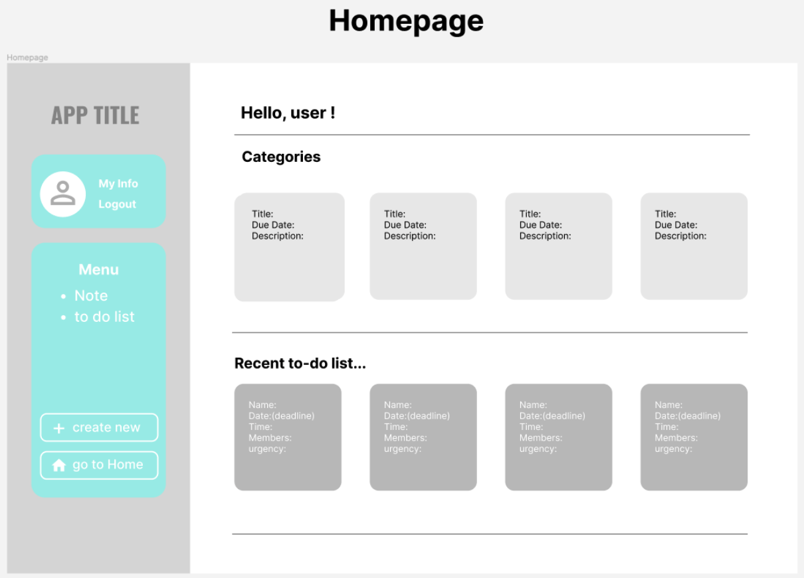
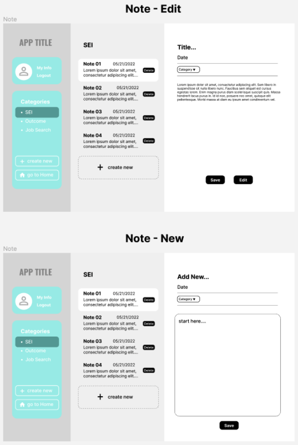
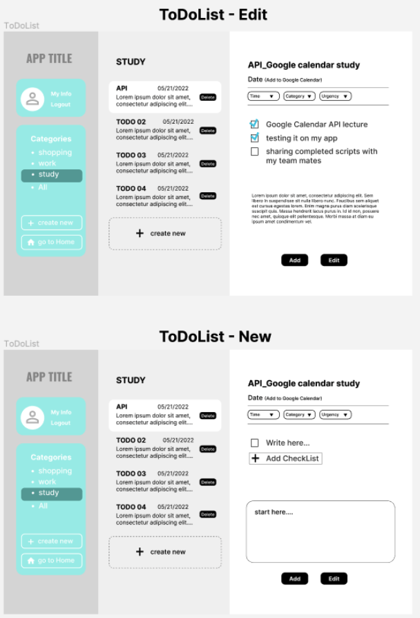
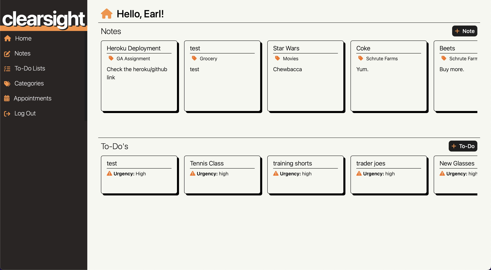
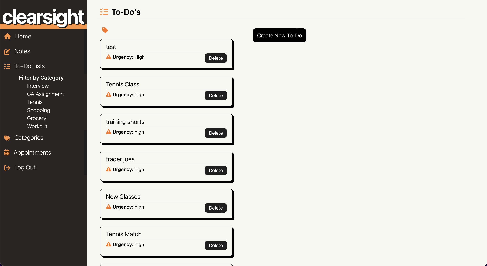
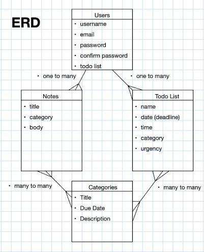
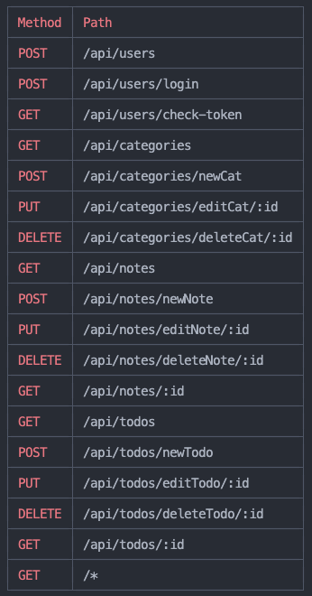

<!-- # ClearSight -->

## Premise: 

Stay organized and manage your day-to-day with ClearSight!
This is a personal task management app, a place where you can create notes and todos that makes it easy to stay organized and manage your life. 

Happy organizing!

## Getting started:
[ClearSight Link](https://clearsight-sei.herokuapp.com/)

[Trello Board Link](https://trello.com/invite/b/LqfJ94a2/8a2a0c57a5bff3e1d0ffb2942ebff9af/group-project)

## User Story:

- Users should be able to create their own profiles to get access to their notes and todos.
- Users should be able to create, edit and delete their own todos.
- Users should also be able to create, edit and delete their own categories to sort their notes and todos.

## Wireframes:
 

Concept idea for the homepage.

Concept ideas for the notes index and new pages.

Concept ideas for the todos index and new pages.

Finished homepage.

Finished notes page.

Finished todos page.

## The ERD: 

The proposed ERD for the project *(entity relationship diagram)*

## Route Table:
 
 
List of the routes used.

## Technologies Used:
- JavaScript
- Css
- Mongodb
- Node.js
- Express
- React
- MERN

## MVP Requirements:
- Be a full-stack MERN application.
- Connect to and perform data operations on a Mongo database.
- If consuming an API, have at least one data entity (Model) in addition to the built-in User model. The related entity can be either a one-to-many (1:M) or a many-to-many (M:M) relationship.
- If not consuming an API, have at least two data entities (Models) in addition to the built-in User model. It is preferable to have at least one one-to-many (1:M) and one many-to-many (M:M) relationship between entities/models.
- Have full-CRUD *(Create, Read, Update, and Delete)* data operations across any combination of the app's models (excluding the User model). 
- Authenticate users using token-based authentication.
- Implement authorization by restricting access to the Creation, Updating & Deletion of data resources.
- Be deployed online using Heroku. Presentations must use the deployed application.

## Future goals:
- [x] Connect an api to add todos onto a calendar
- [ ] Dark mode

